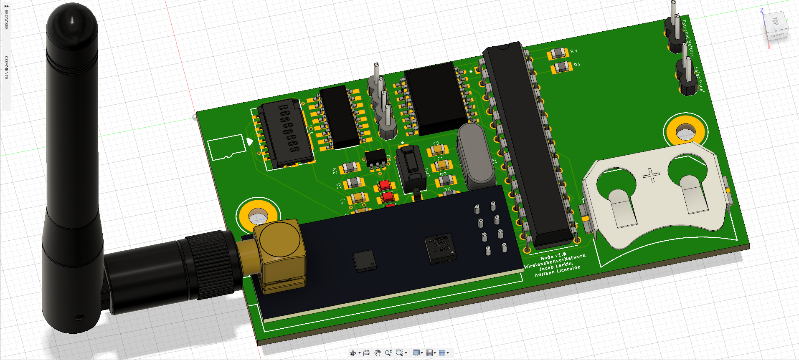

# Wireless Sensor Network
This repository contains the files utilized to create a low-cost wireless sensor network to identify, locate, and quantify CO2 sources within an area. The primary component of the network is the CO2 Sensor Node, for which there are two variants: the Arduino Version and the XBee Version. 

Both have the same essential function of collecting CO2 and wind data. The difference, however, is that the Arduino Version stores data within a microSD card, while the XBee Version sends data to a central hub.

An external repository called the [CSR_Arduino_Collection](https://github.com/RiceAllDay22/CSR_Arduino_Collection) is a complementary project that contains guides, codes, schematics, and datasheets for operating various sensors and modules, especially the ones used in WSN. 

Every hardware and every code in WirelessSensorNetwork and CSR_Arduino_Collection is given the Creative Commons License and the MIT License, respectively. Any content in the repository can be used and changed freely. The only requirement is that the original [license notice](https://github.com/jkub6/WirelessSensorNetwork/blob/master/LICENSE.md) is included in any copy of the software. 

The WirelessSensorNetwork project and the CSR_Arduino_Collection project are led by Adriann Liceralde under the leadership of Dr. Brian McPherson from the Carbon Science Research group at the University of Utah. Any questions, comments, or concerns are welcome to be sent to adriann8399@gmail.com.

Notable contributors to the project are Jacob Larkin, Charlie Leo, Tessa Bailey, Sean Taplin, and Andrew Winkelmann.

(c) Copyright 2022 Jacob Larkin and Adriann Liceralde

## Data analysis and visualization
[AnalyzerStep1](Analysis/AnalyzerStep1.ipynb)  
[AnalyzerStep2](Analysis/AnalyzerStep1.ipynb)

## Node Hardware

The board is designed using Autodesk Eagle.

  
  
  

## Node Software
Code controlling individual nodes is compiled through the Arduino IDE.

Arduino Library Requirments:
 - RTClib
 - SdFat

resources:
[One Drive Resources Folder](https://uofutah-my.sharepoint.com/:f:/g/personal/u1010401_umail_utah_edu/Ekx1kX9h63tNoVFmzbePeowB8LEIOgGHBQhFq369KU12vQ?e=vul3PO)

